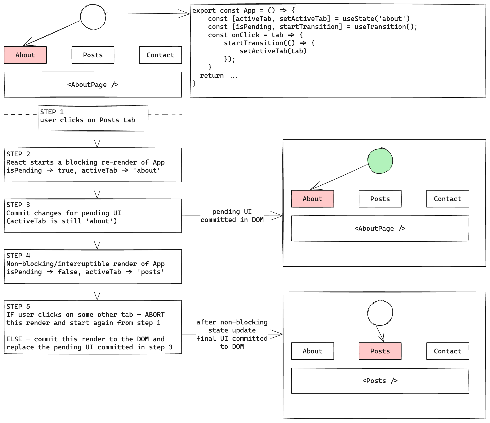
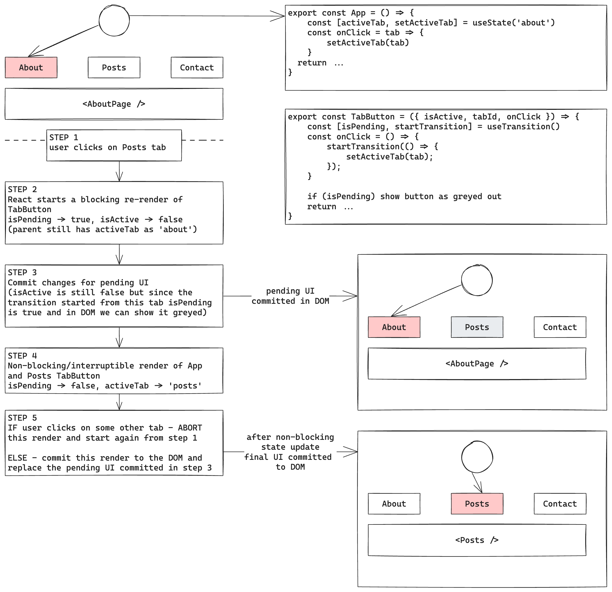
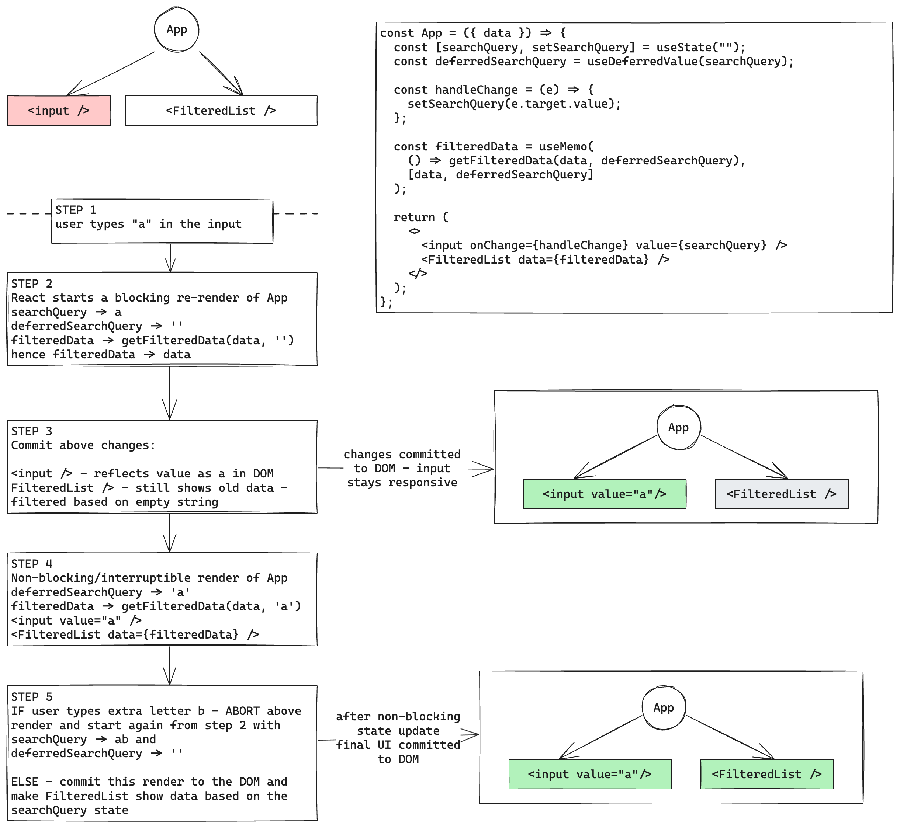

## What is useTransition

As per the React docs `useTransition()` is a hook that lets you update the state without blocking the UI. A state update marked as a transition can be interrupted by other state updates. This way, transitions let you keep the user interface updates responsive even on slow devices.

With a transition, your UI stays responsive in the middle of a re-render. For example, if the user clicks a tab but then change their mind and click another tab, they can do that without waiting for the first re-render to finish.

The goal of this article is to develop a mental model of thinking in terms of transitions. We will see below how invoking useTransition at the top most parent component vs the place responsible for actually triggering the state update impacts the responsiveness of UI.

### Invoking useTransition in App component

For example, let's say we have an `App` component that renders 3 `TabButton`s and based on the selected tab we render some content.

```jsx
function TabButton({ id, isActive, children, onClick }) {
  if (isActive) return <b>{children}</b>;

  return <button onClick={onClick}>{children}</button>;
}

export default function App() {
  const [isPending, startTransition] = useTransition();
  const [activeTab, setActiveTab] = useState("about");

  const handleClick = (id) => {
    startTransition(() => {
      setActiveTab(id);
    });
  };

  return (
    <>
      <TabButton
        isActive={activeTab === "about"}
        onClick={() => handleClick("about")}
      >
        About
      </TabButton>
      <TabButton
        isActive={activeTab === "posts"}
        onClick={() => handleClick("posts")}
      >
        Posts
      </TabButton>
      <TabButton
        isActive={activeTab === "contact"}
        onClick={() => handleClick("contact")}
      >
        Contact
      </TabButton>
      {activeTab === "about" ? <AboutPage /> : null}
      {activeTab === "posts" ? <PostsPage /> : null}
      {activeTab === "contact" ? <ContactPage /> : null}
    </>
  );
}
```

When the user clicks on a tab, we make that tab as the selected tab but we do this state update inside `startTransition`.
This way, if the user clicks a tab but then changes their mind and clicks another tab, they can do that without waiting for the first re-render to finish.

Let's understand this with an example. Initially, `activeTab` is `about`.

1. User clicks on the Posts tab, we call `setActiveTab('posts')` inside a transition.
2. React starts a non-interruptible re-render of `App` component with `isPending` set to `true`, but `activeTab` is still `about`. This allows us to render any "pending" visual UI and React commits it to the DOM.

   One important point to note here is that if we don't want to render any pending UI then we should wrap the state update in `startTransition` exposed from React, rather than the one returned from `useTransition`. This is because React will do a non-interruptible re-render when `startTransition` from `useTransition` is called from the component where `useTransition` was invoked and in above case it is `App` component. If the rendering of `App` component is slow then the UI won't be responsive till the time pending UI is committed to the DOM as it is a non-interruptible render. But we will see very soon why `useTransition` shouldn't be called in the `App` the component tree but rather at the place which is responsible for the state update itself and that too if we are interested in showing pending UI. In our example that would be `TabButton`.

3. Now that React is done with displaying our pending UIs, React starts an interruptible/non-blocking re-render of `App` component with `isPending` set to `false` and `activeTab` as `post`.

   If user clicks on some other tab while this re-render is in progress, **React throws away this render** and repeats the process from the step 2.

   But if this render gets completed then React commits it to the DOM and our UI in the DOM is in sync with the updated state, removing pending UI earlier committed to the DOM if any as this render had `isPending` as `false`.

Below diagram summarizes the flow discussed above



Now suppose if we wanted to highlight the Posts tab button as pending in our above example.

Observe that during step 2, when we received `isPending` as true, `activeTab` was still `about` and we have no information whatsoever to determine which tab is going to come next after transition and hence we can't determine if we should render pending UI for posts tab.
One can also argue that `useTransition` is not a suitable hook for this if it is to be invoked at the `App` component level.

### Moving the invocation to TabButton

But what if move the invocation of `useTransition` down to `TabButton` component? For example:

```jsx
function TabButton({ id, isActive, children, onClick }) {
  const [isPending, startTransition] = useTransition();

  if (isActive) return <b>{children}</b>;
  if (isPending) return <b className="pending">{children}</b>;

  const handleClick = () => {
    startTransition(() => {
      onClick();
    });
  };

  return <button onClick={handleClick}>{children}</button>;
}

export default function App() {
  const [activeTab, setActiveTab] = useState("about");

  const handleClick = (id) => {
    setActiveTab(id);
  };

  return (
    <>
      <TabButton
        isActive={activeTab === "about"}
        onClick={() => handleClick("about")}
      >
        About
      </TabButton>
      <TabButton
        isActive={activeTab === "posts"}
        onClick={() => handleClick("posts")}
      >
        Posts
      </TabButton>
      <TabButton
        isActive={activeTab === "contact"}
        onClick={() => handleClick("contact")}
      >
        Contact
      </TabButton>
      {activeTab === "about" ? <AboutPage /> : null}
      {activeTab === "posts" ? <PostsPage /> : null}
      {activeTab === "contact" ? <ContactPage /> : null}
    </>
  );
}
```

Now let's run through all the steps again considering the scenario that user was on `about` tab and now has clicked on the Posts tab.

1. User clicks on the Posts tab, we call `onClick()` inside a transition which eventually puts the following state update `setActiveTab('posts')` inside a transition.
2. React starts a non-interruptible re-render of `TabButton` component corresponding to posts button with `isPending` set to `true` while `isActive` is still `false` from the props! Here the `activeTab` in App component is still `about` and this allows us to correctly render the pending UI for the Posts button.

   One important point to note here is that in this case only the `TabButton` which kicked off the transition re-rendered and not the whole `App`. This way UI can stay responsive even if re-rendering `App` was heavy, we are just re-rendering one `TabButton` component anyway!

3. Now that React is done with displaying our pending UIs, React starts an interruptible/non-blocking re-render of `App` component with `activeTab` as `post` and inside the Post's `TabButton` `isPending` will be `false`.

   If user clicks on some other tab while this re-render is in progress, **React throws away this render** and repeats the process from the step 2.

   But if this render gets completed then React commits it to the DOM and our UI in the DOM is in sync with the updated state, removing pending UI earlier committed to the DOM if any as this render had `isPending` as `false`.

Below diagram summarizes the steps discussed above:


This way, moving the invocation allowed us to show our pending UIs while keeping our UIs responsive.

## What about useDeferredValue

Unlike transitions where you wrap the state updating code, with `useDeferredValue()`, you instead wrap the value that's in the end generated or changed because of the state update.

Consider the following example:

```jsx
const App = ({ data }) => {
  const [searchQuery, setSearchQuery] = useState("");
  const deferredSearchQuery = useDeferredValue(searchQuery);
  const isPending = deferredSearchQuery !== searchQuery;

  const handleChange = (e) => {
    setSearchQuery(e.target.value);
  };

  const filteredData = useMemo(
    () => getFilteredData(data, deferredSearchQuery),
    [data, deferredSearchQuery]
  );

  return (
    <>
      <input onChange={handleChange} value={searchQuery} />
      <FilteredList data={filteredData} />
    </>
  );
};
```

1. Whenever the user types something in the input, let's say a, we call `setSearchQuery` with that value. Since it is not wrapped inside a transition, it is treated as a high priority update and triggers a non-interruptible render of `App`

2. During the render of `App`, `searchQuery` is `a` but `deferredSearchQuery` still gives us old value which is empty string. Due to this our `isPending` is `true` and our `filteredData` is still calculated based on an empty string and is same as what was calculated in the previous render. During this render, `value` prop of `input` has been set with `a` and the `FilteredList` is still rendered with the `data` prop same as its previous render. We can also use `isPending` variable to display some pending UI.

   Since this state update was a non-interruptible one, if user were to type something in the input while this render was in progress, it won't show up in the DOM till the time React is processing this render. So if the `FilteredList` component is not wrapped with `memo` or if the `filteredData` is not itself calculated in `useMemo()` and if the rendering of `FilteredList` component is slow (even though the props are still the same!), the UI still won't feel responsive to the user even after using `useDeferredValue()`!

   Also, there is a minute caveat regarding the pending UI. If we were to pass the `isPending` to `FilteredList` then even if `FilteredList` is memoized and `filteredData` is calculated in `useMemo()` it will cause `FilteredList` to re-render because `isPending` prop has changed from `false` to `true`. So we have to be very careful how we want to display pending UI without hampering UX.

3. Once React is done with the rendering in step 2, it commits the changes to the DOM. Our `input` reflects the value `a` while our `FilteredList` is still showing the old data.

4. After this, React tries to sync the `deferredSearchQuery` (which is empty string at the moment) with the `searchQuery` value (which is a at the moment) in a non-blocking/interruptible render. If this render gets completed without any interruptions, React will commit it to the DOM with our `filteredData` computed based on `searchQuery` and our `FilteredList` rendered with the new `filteredData`. But, if the user were to type something else while this render was in progress, React will discard this render and repeat the step 2 with the new `searchQuery` while `deferredSearchQuery` is still empty string.

Below diagram summarizes what we discussed above



By above mental model we can easily understand how `useDeferredValue()` improves UI responsiveness (in our case, the responsiveness of typing in `<input />`) while deferring the updates of some part of the UI (in our case, the `<FilteredList />` component) but since the control of what to defer lies with the developers, they have to be extra cautious to makes sure that everything is properly memoized to avoid re-rendering the part of UI that needs to be deferred. This has been mentioned in the API reference of `useDeferredValue` in the [React docs](https://react.dev/reference/react/useDeferredValue)

## References

Below is the list of references which has helped in shaping up my understanding for the topic. I have taken the inspiration from the official React docs for the code examples. Apart from that the docs themselves have made the topic very easy to understand, I have just tried to think of various scenarios on top of that and tried to wrap everything in a concise model.

1. [`useTransition` API reference in React docs](https://react.dev/reference/react/useTransition)
2. [`useDeferredValue` API reference in React docs](https://react.dev/reference/react/useDeferredValue)
3. [React: `useTransition()` vs `useDeferredValue()`](https://academind.com/tutorials/react-usetransition-vs-usedeferredvalue)
